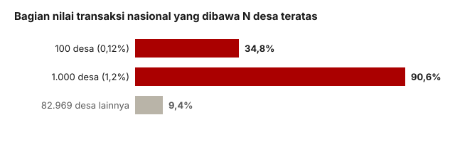

## Pertanyaannya

Berapa banyak data kinerja dalam sistem ini yang benar-benar terisi? Jawabannya menentukan seluruh investigasi: kalau hampir semuanya nol, maka "hasil" yang dilaporkan pemerintah harus dibaca dengan sangat hati-hati.

## Datanya

Kami menghitung satu per satu kolom dalam data tingkat desa (83.069 desa setelah dibersihkan dari duplikat), lalu memisahkannya menjadi dua jenis: kolom yang diisi sekali saat pendaftaran (jumlah rekening, NPWP, NIB) dan kolom yang harus diisi terus-menerus saat operasional (transaksi, simpanan).

## Yang kami temukan

Perbedaannya mencolok. Kolom yang diisi sekali saat pendaftaran nyaris lengkap: rekening 95,8%, NPWP 97%. Kolom yang menuntut laporan berjalan nyaris kosong: **hanya 3,3% desa yang melaporkan transaksi**, dan 12,5% yang melaporkan simpanan apa pun.

| Kolom           | Jenis                        | Terisi |
| --------------- | ---------------------------- | ------ |
| NPWP            | administrasi (sekali isi)    | 97,2%  |
| Jumlah rekening | administrasi (sekali isi)    | 95,8%  |
| NIB             | administrasi (sekali isi)    | 73,1%  |
| Simpanan        | aktivitas (laporan berjalan) | 12,5%  |
| Modal pokok     | aktivitas                    | 11,9%  |
| Iuran wajib     | aktivitas                    | 9,2%   |
| Transaksi       | aktivitas (laporan berjalan) | 3,3%   |

Dan nilainya sangat terkonsentrasi. **100 desa dari 83.069, atau 0,12%, membawa 34,8% dari seluruh nilai transaksi nasional.** Seribu desa membawa 90,6%. Jadi hasil yang dilaporkan program ini bukan "rendah merata"; hasil itu hampir tidak ada, kecuali di beberapa ratus titik.

<figure class="figure">
  
  <figcaption>Nilai yang dilaporkan sangat terkonsentrasi: 100 desa (0,12% dari total) membawa sepertiga dari seluruh nilai nasional.</figcaption>
</figure>

| N desa teratas           | Bagian dari nilai nasional |
| ------------------------ | -------------------------- |
| 10                       | 11,8%                      |
| 50                       | 24,4%                      |
| **100**                  | **34,8%**                  |
| 500                      | 73,5%                      |
| 1.000                    | 90,6%                      |
| 2.726 (semua yang aktif) | 100%                       |

Ini punya arti praktis untuk analisis. Karena 97% datanya nol, kami tidak bisa memakai "nilai transaksi" sebagai ukuran yang berkelanjutan. Yang bisa dipakai adalah ukuran biner (ada atau tidak ada transaksi), atau melihat simpanan, atau hanya membandingkan desa-desa yang memang aktif.

## Yang tidak bisa kami katakan

Pola ini tidak membedakan dua penjelasan: "koperasi memang tidak beroperasi" atau "operasinya terjadi tapi belum dilaporkan". Kolom pendaftaran yang lengkap dan kolom operasional yang kosong konsisten dengan keduanya. Yang bisa memisahkan keduanya adalah uji lain (lihat lampiran 01 dan 09).

Kami juga tidak boleh membaca sebaran antarpulau sebagai bukti: DKI Jakarta melaporkan transaksi di 17,2% desanya, Papua hampir nol, tetapi daerah yang lebih ramai dan lebih terhubung memang lebih banyak bertransaksi **dan** lebih baik dalam melapor. Arahnya sama untuk kedua penjelasan.
