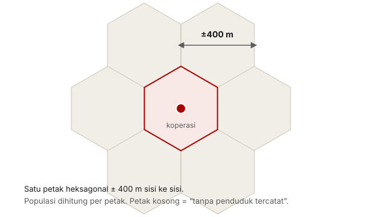

## Pertanyaannya

Siapa yang sebenarnya terjangkau program ini? Tuduhan "dibangun di tempat yang tidak bisa dijangkau siapa pun" diuji di sini dengan peta kepadatan penduduk.

## Datanya

Kami memakai peta populasi berpetak 400 meter yang disusun dari citra satelit dan jejak bangunan (data Kontur), lalu menghitung jarak dari setiap koperasi ke penduduk di sekitarnya. Peta ini mencakup 277 juta orang — sesuai jumlah penduduk Indonesia — jadi cakupannya utuh.

<figure class="figure">
  
  <figcaption>Petak 400 meter berasal dari peta populasi berbentuk heksagon (data Kontur). Angka jangkauan di bawah dihitung dari petak koperasi itu sendiri, lalu petak-petak di sekitarnya.</figcaption>
</figure>

## Yang kami temukan

Jangkauannya justru sangat baik. **95% penduduk Indonesia tinggal dalam sekitar 1,4 km dari sebuah koperasi**, dan 99,8% dalam 5,1 km. Tuduhan "meleset dari penduduk" tidak berlaku sebagai fenomena massal.

| Jarak | Penduduk tercakup | Bagian nasional |
| --- | --- | --- |
| Petak sendiri (400 m) | 64,9 juta | 23,4% |
| ±0,5 km | 203,1 juta | 73,2% |
| **±1,4 km** | **263,7 juta** | **95,0%** |
| ±2,8 km | 274,5 juta | 98,9% |
| ±5,1 km | 277,0 juta | 99,8% |

Tetapi ada ekor yang nyata. **21,3% koperasi (17.774) berada di petak 400 meter tanpa penduduk tercatat**, dan 146 koperasi tidak punya siapa pun dalam radius 5 km. Seratus empat puluh enam itu mungkin hanya 0,2% dari program — tetapi itu 146 kasus nyata dengan nama dan titik koordinat yang bisa diperiksa satu per satu. Dari sinilah lampiran 04 bekerja.

| Penduduk dalam ±5 km | Koperasi | Bagian |
| --- | --- | --- |
| Tidak ada | 146 | 0,18% |
| Kurang dari 500 | 1.569 | 1,88% |
| 500 – 2.000 | 2.406 | 2,89% |
| 2.000 – 10.000 | 8.139 | 9,76% |
| Lebih dari 10.000 | 71.119 | 85,30% |

## Yang tidak bisa kami katakan

"Petak kosong" adalah hasil pemodelan, bukan kebenaran lapangan. Peta yang kami pakai menyatukan empat sumber, dan semuanya kurang akurat di hutan dan pulau kecil — sebagian dari 21,3% itu bisa jadi permukiman sungguhan yang terlewat oleh model.

Cara ini juga ikut menangkap koordinat yang salah: koperasi yang titiknya keliru akan "jatuh" di tempat yang ditunjuk titik itu, sering kali di air atau hutan. Membedakan "dibangun di tempat sepi" dari "koordinatnya salah" butuh citra satelit — itulah isi lampiran 04.
