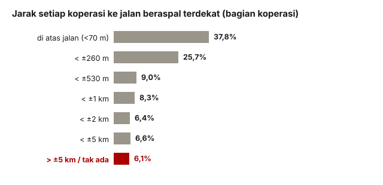

## Pertanyaannya

Seberapa jauh koperasi dari jalan? Untuk sekitar 4,5 juta segmen jalan nasional, mencari jarak satu per satu bisa jadi pekerjaan besar. Kami memecah peta jalan menjadi petak-petak kecil lebih dulu, lalu menghitung jaraknya lewat hitungan petak. Jalan tanah dipisahkan dari jalan beraspal: jalan tanah adalah bukti ada akses, tetapi bukan jalan untuk truk pasokan.

## Yang kami temukan

**6,1% koperasi (5.106) tidak punya jalan beraspal dalam sekitar 5 km; 4.294 di antaranya tidak punya jalan sama sekali**, bahkan jalan setapak. Separuh dari kelompok terakhir ini berjarak lebih dari 9,7 km dari jalan beraspal, dan yang terjauh lebih dari 100 km (diukur dengan tepat di lampiran 08).

<figure class="figure">
  
  <figcaption>Sebagian besar koperasi justru sangat dekat dengan jalan. Ekornya, 6,1% (batang merah), adalah yang menjadi perhatian.</figcaption>
</figure>

| Jarak ke jalan beraspal terdekat  | Koperasi  | Bagian   |
| --------------------------------- | --------- | -------- |
| Di atas jalan (&lt;70 m)          | 31.550    | 37,8%    |
| &lt; ±260 m                       | 21.437    | 25,7%    |
| &lt; ±530 m                       | 7.484     | 9,0%     |
| &lt; ±1 km                        | 6.936     | 8,3%     |
| &lt; ±2 km                        | 5.360     | 6,4%     |
| &lt; ±5 km                        | 5.506     | 6,6%     |
| **&gt; ±5 km atau tak ditemukan** | **5.106** | **6,1%** |

Angka ini diperkuat oleh sumber yang berdiri sendiri. Dari koperasi yang tanpa jalan, 87,4% juga berada di petak tanpa penduduk tercatat, padahal rata-rata nasionalnya 21,3%. Dua sumber dengan metode berbeda setuju, dan itu bukti terkuat di sini.

Geografinya persis seperti yang diduga kritikus: di Papua Selatan 71% koperasi jauh dari jalan; di Jawa Tengah, Jawa Barat, dan DI Yogyakarta angkanya 1% atau kurang.

| Provinsi         | Koperasi | Jauh dari jalan |
| ---------------- | -------- | --------------- |
| Papua Selatan    | 628      | **71,3%**       |
| Papua Tengah     | 1.200    | 64,8%           |
| Papua Barat Daya | 1.024    | 62,7%           |
| Papua Pegunungan | 2.366    | 62,1%           |
| …                | …        | …               |
| Jawa Barat       | 5.968    | 1,7%            |
| DKI Jakarta      | 268      | 1,1%            |
| Jawa Tengah      | 8.524    | 1,0%            |
| DI Yogyakarta    | 438      | **0,0%**        |

## Yang tidak bisa kami katakan

Peta jalan yang kami pakai (OpenStreetMap) sangat baik di Jawa dan lebih tipis di pedalaman Papua, tepat di tempat temuannya terkonsentrasi. Karena itu klaim yang jujur adalah "tidak ada jalan **yang terpetakan** dalam 5 km", dan setiap angka di sini adalah batas atas keterjangkauan.

Jarak juga diukur garis lurus, bukan jarak tempuh: sungai atau punggung bukit di antara titik dan jalan tidak terlihat. Angka ini sebaiknya dikutip dalam rentang, bukan sampai tiga desimal.
