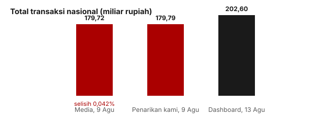

## Pertanyaannya

Seluruh investigasi ini berdiri di atas satu temuan: SIMKOPDES melaporkan hampir tidak ada kegiatan ekonomi. Kementerian punya satu jawaban yang sangat kuat: "websitenya memang belum diperbarui." Uji ini mencoba menutup celah itu dengan bukti dari luar dashboard.

## Caranya

Kalau pernyataan publik kementerian sendiri cocok dengan angka di dashboardnya, maka dashboard itu memang angka resmi, dan bantahan "belum diperbarui" runtuh. Kalau keduanya meleset jauh, itu cerita tersendiri. Kami membandingkan angka yang dilaporkan media dengan penarikan data kami sendiri pada hari yang sama, secara independen.

## Yang kami temukan

Jawabannya: cocok, dan tidak tanggung-tanggung. Pada 9 Agustus, Liputan6 melaporkan total nasional **Rp 179,72 miliar**; penarikan kami sendiri pada hari yang sama menghasilkan **Rp 179,79 miliar**, selisih 0,042%, setara beberapa jam perbedaan waktu. Ini angka yang sama. Pemerintah mengutip website ini, jadi apa pun yang dikatakan dashboard tentang kegiatan adalah catatan publik resmi pemerintah tentang programnya.

<figure class="figure">
  
  <figcaption>Dua angka di kiri, media dan penarikan kami pada hari yang sama, adalah angka yang sama (selisih 0,042%). Angka di kanan menunjukkan totalnya telah tumbuh pada 13 Agustus.</figcaption>
</figure>

| Sumber (9 Agustus)          | Total            |
| --------------------------- | ---------------- |
| Dilaporkan media (Liputan6) | Rp 179,72 miliar |
| Penarikan kami sendiri      | Rp 179,79 miliar |

Sumber kedua tidak menyentuh dashboard sama sekali. Pada 8 Juni, kepala badan komunikasi pemerintah menyebut **1.061 koperasi beroperasi** dari daftar sekitar 80.000, atau 1,3%. Ukuran kami dua bulan kemudian: 3,0% desa yang melaporkan transaksi apa pun. Dua pengukuran independen dengan metode berbeda berakhir di angka tunggal yang sama rendah, di dua provinsi yang sama (Jawa Timur dan Jawa Tengah).

Sekitar Rp 2,43 juta per koperasi, kira-kira setara sebulan belanja keluarga, untuk seumur hidup koperasi itu. (Angka total telah naik menjadi Rp 202,6 miliar pada 13 Agustus.)

| Hingga     | Total            | Desa yang melapor |
| ---------- | ---------------- | ----------------- |
| 31 Juli    | Rp 157,90 miliar | —                 |
| 9 Agustus  | Rp 179,72 miliar | 2.517             |
| 13 Agustus | Rp 202,60 miliar | 2.726             |

## Yang tidak bisa kami katakan

Ini tidak membuktikan perdagangan di baliknya kecil. Ini membuktikan catatan publik pemerintah dan dashboardnya adalah catatan yang sama. Koperasi bisa saja berdagang ramai tanpa melaporkan apa pun, dan kedua sumber sama-sama buta terhadapnya. Nol tetap berarti "belum melaporkan", bukan "tidak aktif".

Seri potret bulanan menjadi lebih berharga karena uji ini: setiap potret adalah catatan resmi pemerintah atas programnya sendiri.
