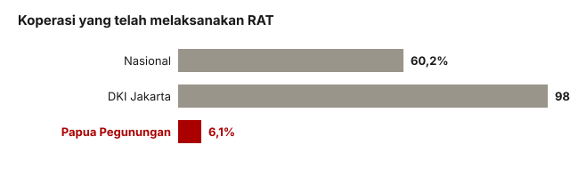

## Pertanyaannya

Apakah koperasi benar-benar menggelar Rapat Anggota Tahunan (RAT)? Versi awal situs ini menyatakan "RAT nol di semua provinsi" — dan laporan ini ada untuk mengoreksinya.

## Yang kami temukan

**60,2% koperasi (50.174 dari 83.382, per 5 Agustus) tercatat telah melaksanakan RAT.** Angkanya stabil dan bergerak: 50.174 → 50.188 (9 Agustus) → 50.200 (13 Agustus, sama dengan yang ditampilkan dashboard). Saluran RAT terisi dan berjalan — kebalikan dari "saluran tata kelola kosong" yang ditakuti rencana analisis.

<figure class="figure">
  
  <figcaption>RAT tidak nol di mana-mana. Rata-rata nasional 60,2% — tetapi jurang antara Jawa dan Indonesia timur tetap besar.</figcaption>
</figure>

Klaim "nol di semua provinsi" berasal dari salah baca kolom: satu jalur data mengembalikan nol pada setiap penarikan, sementara angka sebenarnya ada di kolom lain yang justru dipakai dashboard kementerian sendiri.

Sebarannya mengikuti gradien yang sudah dikenal: 98,9% di DKI Jakarta dan Sumatera Barat, turun ke **6,1% di Papua Pegunungan**. Kepatuhan RAT ikut bergerak dengan aktivitas (korelasi dengan nilai transaksi per koperasi 0,44) — tata kelola dan operasi berjalan bersama, keduanya mengikuti peta ekonomi.

| Provinsi | Bagian telah RAT |
| --- | --- |
| DKI Jakarta | 98,9% |
| Sumatera Barat | 98,9% |
| Papua Barat Daya | 21,3% |
| Papua Selatan | 16,2% |
| Papua Pegunungan | **6,1%** |

## Yang tidak bisa kami katakan

Kolom RAT hanya terisi di tingkat provinsi — tingkat kabupaten, kecamatan, dan desa semuanya nol, jadi peta RAT per desa tidak mungkin dibuat dari API ini. Sekitar 40% koperasi (~33.200) belum melaksanakan RAT: itu celah yang nyata dan besar, hanya saja bukan nol, dan terkonsentrasi di Indonesia timur. Dan "melaksanakan RAT" di sini adalah laporan ke sistem, bukan rapat yang diaudit.
